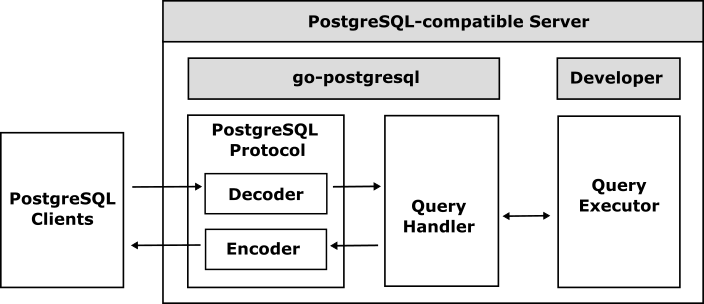

# go-postgresql


[](https://github.com/cybergarage/go-postgresql/actions/workflows/make.yml)
[](https://pkg.go.dev/github.com/cybergarage/go-postgresql) [](https://codecov.io/gh/cybergarage/go-postgresql)

go-postgresql is a framework for building [PostgreSQL](https://www.postgresql.org/) compatible servers in Go.

## Overview

go-postgresql implements the [PostgreSQL wire protocol](https://www.postgresql.org/docs/current/protocol.html) and automatically interprets the major message flow (startup, authentication, parameter/status, etc.). This lets you focus on implementing your own DDL (Data Definition Language) and DML (Data Manipulation Language) logic instead of re‑implementing the protocol machinery.



All startup and system messages are handled for you. Provide implementations for the SQL execution interfaces and you have a functioning PostgreSQL‑compatible server.

## Features

Core capabilities provided by go-postgresql:

- Full PostgreSQL wire protocol handling (startup, authentication prompts, message flow, ready states)
- Pluggable SQL execution via the `go-sqlparser` executor interface
- Extensible authentication (password / TLS client cert integration via `go-authenticator`)
- Structured error response generation matching PostgreSQL fields
- COPY (simple) stream handling helpers
- Prepared statement and portal management
- Tracing hooks (span start/finish) using `go-tracing`
- Modular connection and message reader abstractions
- Integration helpers for system catalog style queries

Optional integrations (via related Cybergarage projects):

- Test harness utilities (`go-sqltest`)
- Safe numeric and type conversion (`go-safecast`)
- SASL authentication flows (`go-sasl`)
- Deterministic logging and debugging (`go-logger`)

## Table of Contents

- [Getting Started](doc/getting-started.md)
- [Examples](doc/examples.md)
- [References](doc/references.md)

## Examples

Representative example projects built with go-postgresql:

- [go-postgresqld](examples/go-postgresqld) – Minimal in‑memory server example. [](https://hub.docker.com/repository/docker/cybergarage/go-postgresqld/)
- [go-sqlserver](https://github.com/cybergarage/go-sqlserver) – Alternative SQL server implementation. [](https://hub.docker.com/repository/docker/cybergarage/go-sqlserver/)
- [PuzzleDB](https://github.com/cybergarage/puzzledb-go) – Pluggable multi‑model database. [](https://hub.docker.com/repository/docker/cybergarage/puzzledb/)

### Quick Docker Run (Examples)

Run the example in‑memory server (`go-postgresqld`) locally:

```bash
docker run --rm -p 5432:5432 cybergarage/go-postgresqld:latest
```

Connect using `psql` (requires it installed):

```bash
psql "host=127.0.0.1 port=5432 user=postgres sslmode=disable"
```

Run the PuzzleDB example image:

```bash
docker run --rm -p 5432:5432 cybergarage/puzzledb:latest
```

Tip: Use `-e POSTGRES_INIT=...` (if the image supports custom init scripts) or mount volumes for persistence in extended setups.

## Related Projects

go-postgresql is developed in collaboration with other Cybergarage libraries:

- [go-logger](https://github.com/cybergarage/go-logger) 
- [go-safecast](https://github.com/cybergarage/go-safecast) 
- [go-sqlparser](https://github.com/cybergarage/go-sqlparser) 
- [go-tracing](https://github.com/cybergarage/go-tracing) 
- [go-authenticator](https://github.com/cybergarage/go-authenticator) 
- [go-sasl](https://github.com/cybergarage/go-sasl) 
- [go-sqltest](https://github.com/cybergarage/go-sqltest) 
- [go-pict](https://github.com/cybergarage/go-pict) 

## References

- [PostgreSQL](https://www.postgresql.org/)
  - [Frontend/Backend Protocol](https://www.postgresql.org/docs/current/protocol.html)
  - Additional links in [doc/references.md](doc/references.md)
