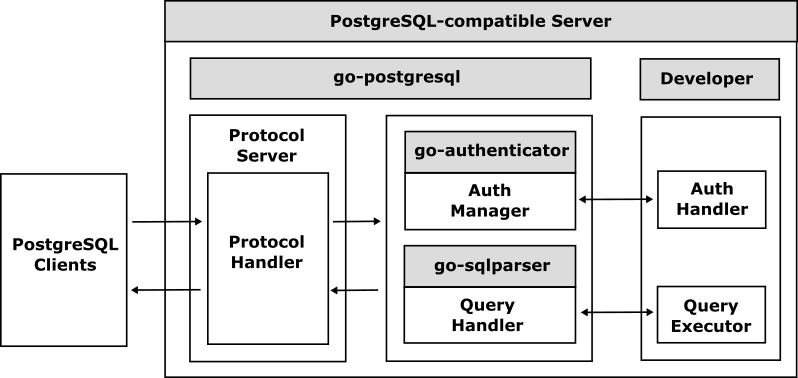

# go-postgresql

 

The go-postgresql is a database framework for implementing a [PostgreSQL](https://www.postgresql.org/)-compatible server using Go easily.

## What is the go-postgresql?

The go-postgresql handles [PostgreSQL protocol](https://dev.postgresql.org/doc/dev/postgresql-server/latest/) and interprets the major messages automatically so that all developers can develop PostgreSQL-compatible servers easily. 
 

Since the go-postgresql handles all startup and system commands automatically, developers can easily implement their PostgreSQL-compatible server only by simply handling DDL (Data Definition Language) and DML (Data Manipulation Language) query commands.

## Table of Contents

- [Getting Started](doc/getting-started.md)

## Examples

- [Examples](doc/examples.md)
  - [go-postgresqld](examples/go-postgresqld)
	- [go-sqlserver](https://github.com/cybergarage/go-sqlserver)
	- [PuzzleDB](https://github.com/cybergarage/puzzledb-go)

## References

- [PostgreSQL](https://www.postgresql.org/)
  - [PostgreSQL: Documentation: Frontend/Backend Protocol](https://www.postgresql.org/docs/current/protocol.html)
