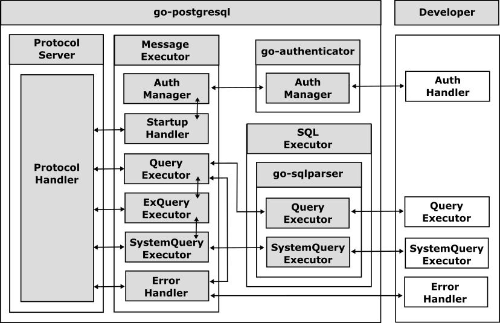

# Getting Started

This quick guide walks through building a PostgreSQL‑compatible server with `go-postgresql`. For a working reference implementation, see the [Examples](examples.md).

## Concept

`go-postgresql` exposes overridable interfaces for each wire‑protocol phase. In practice you usually only implement a `go-sqlparser` powered `sql.Executor`; the library handles startup, authentication prompts, ready/status messaging, and error wrapping.



Default message executors cover the protocol flow. You optionally supply:

- An authentication handler (if you need credential checks)
- A SQL executor (required)
- Custom error handling (rarely needed)

## Step 1: Embed the Core Server

The core type [`postgresql.Server`](../postgresql/server.go) manages protocol I/O. Embed it in your server struct:

```go
import "github.com/cybergarage/go-postgresql/postgresql"

type MyServer struct {
    postgresql.Server
}

func NewMyServer() *MyServer {
    return &MyServer{Server: postgresql.NewServer()}
}
```

## Step 2: Provide a SQL Executor

Define the query operations by implementing the [`sql.Executor`](https://github.com/cybergarage/go-sqlparser/blob/master/sql/executor.go) interface from `go-sqlparser` (shared with `go-mysql`).

Interface summary:

```go
type Executor interface {
    Begin(Conn, Begin) error
    Commit(Conn, Commit) error
    Rollback(Conn, Rollback) error
    CreateDatabase(Conn, CreateDatabase) error
    CreateTable(Conn, CreateTable) error
    AlterDatabase(Conn, AlterDatabase) error
    AlterTable(Conn, AlterTable) error
    DropDatabase(Conn, DropDatabase) error
    DropTable(Conn, DropTable) error
    Insert(Conn, Insert) error
    Select(Conn, Select) (ResultSet, error)
    Update(Conn, Update) (ResultSet, error)
    Delete(Conn, Delete) (ResultSet, error)
    SystemSelect(Conn, Select) (ResultSet, error)
    Use(Conn, Use) error
}
```

Register your executor implementation:

```go
func NewMyServer() *MyServer {
    s := &MyServer{Server: postgresql.NewServer()}
    s.SetSQLExecutor(s)
    return s
}

func (s *MyServer) Select(conn Conn, stmt Select) (ResultSet, error) {
    // Your query logic
    return nil, nil
}
```

You can override other protocol handlers, but start with only the executor to keep things simple.

## Step 3: Start and Stop

```go
srv := NewMyServer()
if err := srv.Start(); err != nil {
    panic(err)
}
defer srv.Stop()
// Serve until shutdown
```

## Next Steps

Explore the example server, add authentication, and implement storage adapters or tracing using the related Cybergarage libraries.
